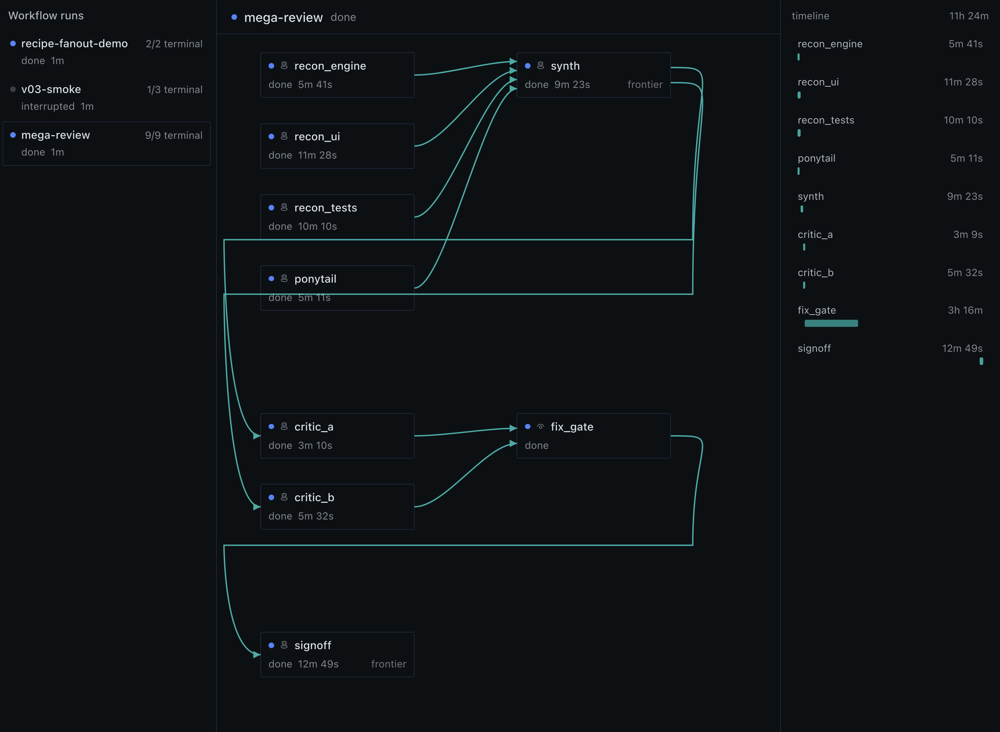
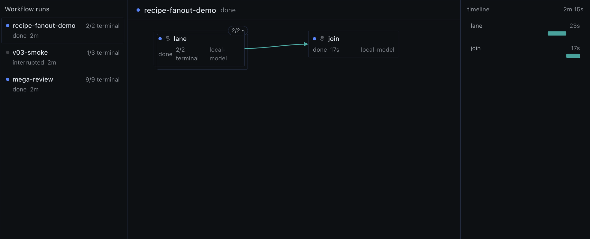
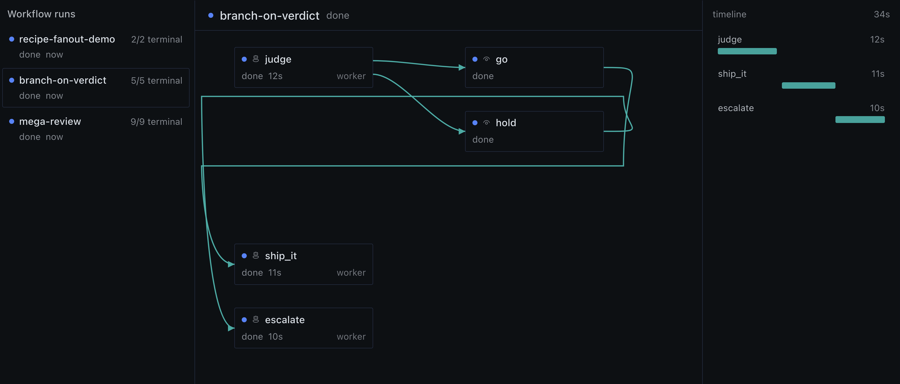

# Hermes Workflows

**Agent-owned workflow graphs for [Hermes Agent](https://github.com/NousResearch/hermes-agent).**
Your agent authors a JSON graph of agent nodes, fan-outs and gates; a background
runner executes it, survives restarts, and hands results back through the same
`workflow` tool it launched from. Hermes Desktop draws the live DAG.



## What you get

| Capability | In one line |
|---|---|
| **Graph runs** | Agent nodes with `goal`, `after` edges, per-node `model`/`provider`/`reasoning`, and `max_turns`/`timeout`/`run_budget` caps |
| **Fan-out** | One node → N live children from `fanout.items` or `items_from:"<node>.items"`; per-item liveness, `quorum` |
| **Human + machine gates** | A `gate` holds on a question until `release`; `gate.wait` holds for a timer or an argv probe; `when` predicates branch on upstream output; `on_skip:"prune"` kills the losing arm |
| **Fingerprint resume** | Every finished node records an effective fingerprint. Crash, restart, or `amend` the graph — only what actually changed re-runs |
| **Cooperative steer** | `steer` queues text; a running child pulls it at its next seam via the tool's `inbox` action |
| **Typed failures** | Every `node.failed` event carries `error_class` + `attempts` (`timeout`, `max_turns`, `provider_400`, `schema_fail`, …) — the parent never infers a cause from prose |
| **Compact status** | Mid-run `status`/`wait` return output *pointers*; `detail:"full"` opts into everything; terminal payloads are always full |
| **Desktop DAG view** | Live graph, fan-out stacks, timeline, and a `::workflow{id="…"}` inline card in any reply |
| **Library** | `save` a proven graph, `library` lists it, `run` with `from:` replays it |
| **Authoring skill** | Bundled `workflow` skill with grammar, operations, and **measured** per-shape budget recipes |

<table><tr>
<td width="50%"><br><sub><b>Fan-out.</b> One node, two live children; items stack behind the card and the join reads both outputs.</sub></td>
<td width="50%"><br><sub><b>Branch on verdict.</b> Two complementary <code>when</code> gates on one judge; each arm runs only when its gate opens.</sub></td>
</tr></table>

## Install

```sh
hermes plugins install hermes-workflows      # from the catalog (pinned SHA)
hermes plugins enable hermes-workflows
```

Restart the backend (`hermes serve`) so the tool and dashboard routes mount.
If Hermes Desktop runs on a **different machine** than the backend, copy
`desktop/plugin.js` to that machine's `~/.hermes/desktop-plugins/hermes-workflows/plugin.js`
— the app hot-loads it. Manual/zip install and removal: [INSTALL.md](INSTALL.md).

Then ask your agent for a workflow. The bundled skill teaches it the grammar;
the smallest graph is one node:

```json
{ "name": "check",
  "nodes": [{ "id": "inspect", "type": "agent",
              "goal": "Inspect the target. Return one fenced JSON object." }] }
```

```
workflow { "action": "run",  "graph": <the object above> }   → run_id
workflow { "action": "wait", "run_id": "<run_id>" }          → repeat until terminal
```

## Two builds, one codebase

The plugin needs **no patched Hermes**. Every child spawn rides the stock quiet
one-shot CLI contract, and every install runs the same code. Exactly one field
differs, and it is optional:

|  | stock Hermes (catalog install) | with the optional core patch |
|---|---|---|
| graphs, fan-out, gates, steer, resume, desktop view, cards | ✓ | ✓ |
| a child that dies on its `max_turns` cap | `error_class: unknown` + preserved partial/log | typed `error_class: max_turns` + reason |
| how | nothing to do | one sha-stamped patch — [docs/patched-core.md](docs/patched-core.md) |

The tier is self-reported: after a failed child, `status` shows
`turn_report: typed` or `untyped`, so you always know which build you're on.
When upstream [PR #121041](https://github.com/NousResearch/hermes-agent/pull/121041)
lands, the branch collapses and that doc deletes itself.

## Requirements

- Hermes Agent **≥ v2026.9.21** (the quiet turn-report file the runner reads;
  measured floor, see [docs/catalog/pr-body.md](docs/catalog/pr-body.md))
- Python 3 (stdlib only — the plugin imports nothing outside Hermes)
- Node for the desktop half's tests only; the app loads `plugin.js` uncompiled

## For agents and contributors

[AGENTS.md](AGENTS.md) is the front door: repo map, install/operate/contribute
procedures, the test contract, and the rules that keep the tree publishable.
Changes are gated by the serial suite (`python3 scripts/suite.py . ci-out`) and
`hermes plugins validate .` — both run in [CI](.github/workflows/ci.yml).

## License

MIT — see [LICENSE](LICENSE).
