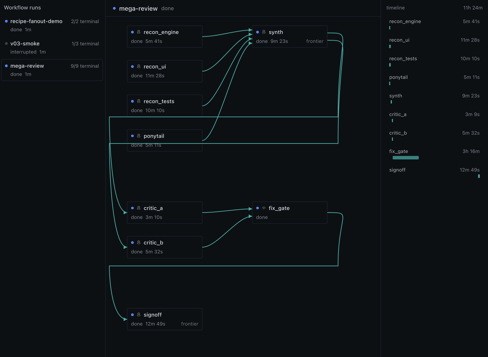
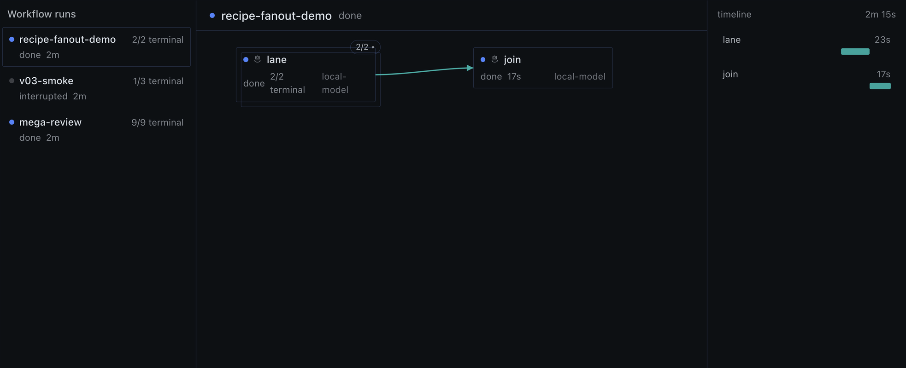
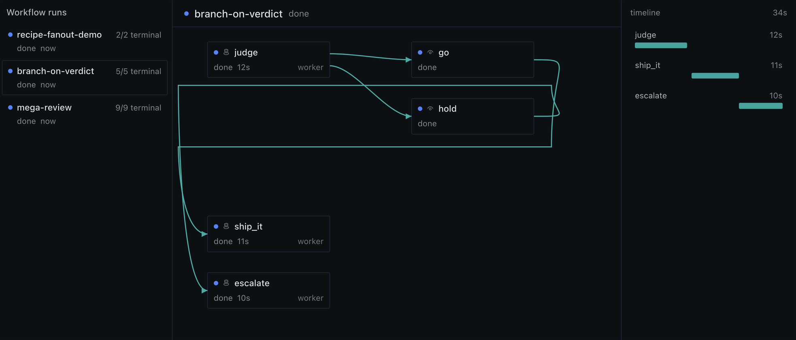

# Hermes Workflows


**Agent-owned workflow graphs for [Hermes Agent](https://github.com/NousResearch/hermes-agent).**
Your agent authors a JSON graph of agent nodes, fan-outs and gates; a background
runner executes it outside the caller process tree and hands results back through
the same `workflow` tool it launched from. Hermes Desktop draws the live DAG.



## Why this exists

A single agent turn is one long, fragile thread of work: one context, one
timeout, no resumable checkpoints. A **graph** splits the job into nodes with
explicit dependencies — parallel recon lanes, a synthesis join, an adversarial
review gate — each node a separate child session with its own model, budget, and
typed failure. When something dies or you change your mind mid-flight, only the
affected nodes re-run: completed work is replayed from its stored fingerprint,
not re-paid.

## What you get

| Capability | In one line |
|---|---|
| **Graph runs** | Agent nodes with `goal`, `after` edges, per-node `model`/`provider`/`reasoning`, and `max_turns`/`timeout`/`run_budget` caps; optional per-graph `concurrency`/`item_concurrency`, clamped to owner caps |
| **Fan-out** | One node → N live children from `fanout.items` or `items_from:"<node>.items"`; per-item liveness; `quorum` cancels stragglers once N commit (they are `cancelled`, never a failure) |
| **Human + machine gates** | A `gate` holds on a question until `release`; `gate.wait` holds on a timer or an argv probe at zero token cost; `when` predicates branch on upstream output; `on_skip:"prune"` retires the losing arm |
| **Fingerprint resume** | Crash, restart, or `amend` the graph mid-flight — nodes whose effective fingerprint still matches replay-skip; only what actually changed re-runs. `run`/`amend` accept `dry_run:true` for a no-write preview |
| **Cooperative steer** | `steer` queues text for a running node; the child pulls it at its next natural seam via the tool's `inbox` action — prompts are never rewritten mid-flight |
| **Profile delegation** | A node can run *as* another local Hermes profile (its instructions, memory, tools) behind a per-profile consent file — multi-personality graphs on one machine, no isolation claimed |
| **Typed failures** | Every `node.failed` carries `error_class` + `attempts` from a closed set (`timeout`, `cap_exhausted`, `provider_400`, `schema`, `precondition`, `cancelled`, `fatal_quota`, `route_unavailable`, …) — you never infer a cause from prose; failed nodes ship `node_facts` (class, attempts log, final words, log path) |
| **Route integrity** | A node that pins a `model` is fail-closed (`require_route`, on by default): a proven-dead pin refuses to launch rather than silently bill another model; with an owner-configured `confidence_substrate` ladder (#116) the substitution is engine-stamped and disclosed in the node's result contract — never silent |
| **Process-tree honesty** | An exit-0 child is believed only when its whole process tree is dead; a backgrounded worker is typed, never mistaken for done, and a fenced answer over a live tree commits `partial` with proof |
| **Compact status** | Mid-run `status`/`wait` return output *pointers* and per-node metrics (missing evidence reads unknown, never a false zero); `detail:"full"` opts into everything |
| **Wedged-lock recovery** | The runner is admitted by a kernel flock on `runner.lock` held for the process's whole life — a dead holder's lock is released by the kernel itself, the next spawn contends cleanly, and there is no stale lock to clear by hand |
| **Desktop DAG view** | Live graph, fan-out stacks, timeline, and a `::workflow{id="…"}` inline card in any reply; RUNNING / THE REST agent-first panes (every row carries its originating agent), and a session strip under the composer showing this chat's runs (core ≥ v2026.7.30; older shells get the fallback slot) |
| **Library** | `save` a proven graph (description + tags — flat or `facet:value`, e.g. `use_case:code-review`), `library` lists it richly and filters by tags (with a `tag_vocab` echo so agents reuse the live taxonomy), `run from:"<name>"` replays it; a hand-rolled graph the library missed goes to `submit` with a `why_not_library` receipt — quarantined for study, never auto-saved; `inbox kind:"submissions"` lists them |
| **Composite graphs** | A graph-level `include` expands shelved library graphs into a run at launch — namespace-isolated ids, cycle/depth/size guards, model policy unions in and never relaxes (shipped in v1.3.0) |
| **Authoring skill** | Bundled `workflow` skill: grammar, operations, and **measured** per-shape budget presets (`recon`/`build`/`review`/`publish`) |

<table><tr>
<td width="50%"><br><sub><b>Fan-out.</b> One node, two live children; items stack behind the card and the join reads both outputs.</sub></td>
<td width="50%"><br><sub><b>Branch on verdict.</b> Two complementary <code>when</code> gates on one judge; each arm runs only when its gate opens.</sub></td>
</tr></table>

## The `workflow` tool

One tool, action-routed — the complete surface, with the flags that matter:

| Action | What it does |
|---|---|
| `run` | Launch a graph from `graph` (inline), `graph_path` (≤1 MiB local file), or `from` (library name). Optional `name`, `run_context` (seed string, or a binding map replacing `{run.KEY}` refs — malformed input is refused before anything is written; values land in prompts, so no secrets), `team`, `lane_key` (dedupe: a second run on an unfinished incumbent returns it instead of spawning), `dry_run:true` (full validation, zero writes). |
| `status` | Read-only read model: per-node state, metrics, held gate, `node_facts` on failures, derived `next` steps — never spawns a runner. `lane_key` reads the incumbent instead; a lane entry whose claimed run dir no longer exists on disk reports `state: "orphaned"` (a claimed-then-lost run, not a forever-`pending` ghost). |
| `wait` | The resume-and-watch verb: the only read action that respawns an idle runner; blocks to the next boundary (default 600 s, ceiling 1800 s), self-yielding before the host's tool deadline with a "call wait again" note. |
| `release` | Answer a held human gate (`gate_id`, `answer`); respawns the runner when idle. A human release pre-empts a machine `wait` park. |
| `steer` | Queue steering text for a running node (refused on gates and terminal nodes; delivery is cooperative via the child's `inbox` pull — never a mid-prompt injection). |
| `inbox` | Child-side pull of steering lines baked for this spawn — exactly-once per spawn. Parent-side `kind:"submissions"` lists `submit` items newest-first. |
| `amend` | Replace the graph mid-run with the whole new graph (`dry_run:true` previews `will_rerun` without writing). Fingerprint-valid unchanged nodes replay-skip. |
| `stop` | Request a stop at the next boundary; in-flight children are killed; stop ≠ failure — cancelled work re-drives on resume, and a `lane_key` is freed for the next dispatch. |
| `list` | All runs (capped page + full-census counts, per-run provenance rollup when present). |
| `save` | Shelve a graph in the library under a name (overwrite = current best): `description`, `tags` (1–10, flat or `facet:value`; reuse `library`'s `tag_vocab` verbatim), optional `source` attribution writes provenance (owner, digest, timestamp) — attribution, never access control. |
| `submit` | Quarantine a hand-rolled graph the library didn't cover for human-gated study — requires a `why_not_library` receipt (≥80 chars); never joins the library. |
| `library` | List shelved graphs richly (nodes, gates, fan-outs, description, tags, provenance), filterable by ALL-match tags; an empty filtered result says which tag starved. |
| `validate` | Dry-run the door's validation pipeline (defaults fill, defect collection, model/route policy) with no ping and no writes — `{ok, errors:[{node,field,msg}], resolved_routes}`. |
| `doctor_version` | Read-only version truth for THIS install: `{live_version, newest_packaged, source_commit, drift}` — plugin.yaml vs the `install.json` provenance `pack.py` stamps at build time; one read, no network. |

Plus a `/wf` slash command: bare `/wf` lists the library; `/wf <name> [note]`
launches that graph with the note as its context seed. `/wf show <name>` (or
`workflow {"action":"library","name":"<name>"}`) returns required inputs and
an instantiate command. Library-sourced launches require nonempty string bindings
for every `{run.KEY}` on the shared text surface, including echo output, gate
options and machine argv; surviving refs refuse before any write. Inline graphs
retain their existing behavior, including refusing unbound machine argv.

Optional `save params:{KEY:{desc,default}}` stores descriptive `meta.params` in
the envelope. Required keys derive from graph refs, not this declaration; defaults
are suggestions in the instantiate command, never automatic launch bindings.
Omission retains params on overwrite; `{}` clears them deliberately. Missing or
dead declarations on an envelope save produce non-fatal `s12` save warnings
naming the keys; a bare save's contract derives wholly from refs. Bare,
ref-free library rows and clean save responses keep their previous key sets.

## Graph grammar in 30 seconds

Three node types — `agent`, `gate`, `echo` — and a closed key set per type
(anything outside it is refused at submit with a per-defect error list, never
silently ignored). The smallest useful graph:

```json
{ "name": "check",
  "nodes": [{ "id": "inspect", "type": "agent",
              "goal": "Inspect the target. Return one fenced JSON object." }] }
```

```
workflow { "action": "run",  "graph": <the object above> }   → run_id
workflow { "action": "wait", "run_id": "<run_id>" }          → repeat until terminal
```

Fan-out with `quorum`, gates with `when`/`on_skip`/`wait`, `requires` output
preconditions, `after_partial` harvest release, `inputs` selection from upstream
output, string-field `enum`s, answer-schema floors `minItems` (on `type:"array"`)
and `minLength` (on `type:"string"`, counted on stripped chars — a whitespace-only
string is too short), graph-level `defaults` (precedence: explicit node
key > `shape` preset > `defaults`) and `model_policy` — the authoritative
vocabulary is [references/grammar.md](references/grammar.md); the bundled
authoring skill keeps a compressed working copy in [SKILL.md](SKILL.md).
Runnable templates in [examples/](examples/), grouped by role —
`basics/` (one idea each), `build/` (fan-out and ledgers), `review/`
(independent judgment), `release/` (issue→PR, release lifecycle, gates and
watchers), `ops/` (incidents). [examples/README.md](examples/README.md) is the
map: one line per template, what it teaches, and which arm its receipts proved.

## What a run leaves behind

Each run is a directory (`~/.hermes/workflows/<run-id>/` by default): the
committed `graph.json`, an append-only `events.jsonl` typed event log, per-node
results under `nodes/`, prompts and logs under `logs/`, gate answers under
`gates/`, and a `summary.md`. Resume, `amend`, and the desktop all read the same
shared state. There is no hidden control plane and no daemon: exactly one runner
process per run, admitted by a kernel lock, spawned outside the caller's process
tree. Run states (`running`, `held`, `interrupted`, `done`, `failed`,
`stopped`), owner wake semantics, silent-runner reaping, and recovery
procedures:
[references/operations.md](references/operations.md).

## Install

```sh
hermes plugins install hermes-workflows      # from the catalog (pinned SHA)
hermes plugins enable hermes-workflows
```

Restart the backend (`hermes serve`) so the tool and dashboard routes mount.
Before disabling or removing the plugin, stop live runs: use `workflow {"action":"list"}`
to find their run IDs, then `workflow {"action":"stop","run_id":"<id>"}` for each.
Detached runners can outlive a session, gateway restart, or plugin disable until a
boundary; disabling alone does not stop them. Desktop gate answers use the SDK to
send a visible resume turn to the run owner's chat; older Desktop builds insert
text for you to send, or ask you to type `workflow wait` in that owner chat.
If Hermes Desktop runs on a **different machine** than the backend, copy
`desktop/plugin.js` to that machine's `~/.hermes/desktop-plugins/hermes-workflows/plugin.js`
— the app hot-loads it. Manual/zip install and removal: [INSTALL.md](INSTALL.md).

## Two builds, one codebase

The plugin needs **no patched Hermes**. Every child spawn rides the stock quiet
one-shot CLI contract, and every install runs the same code. Exactly one field
differs, and it is optional:

|  | stock Hermes (catalog install) | with the optional core patch |
|---|---|---|
| graphs, fan-out, gates, steer, resume, desktop view, cards | ✓ | ✓ |
| a child that dies on its `max_turns` cap | `error_class: unknown` + preserved partial/log | typed `error_class: cap_exhausted` + reason |
| how | nothing to do | one sha-stamped patch — [docs/patched-core.md](docs/patched-core.md) |

The tier is self-reported: after a failed child, `status` shows
`turn_report: typed` or `untyped`, so you always know which build you're on.
When upstream [PR #121041](https://github.com/NousResearch/hermes-agent/pull/121041)
lands, the branch collapses and that doc deletes itself.

## Requirements

- Hermes Agent **≥ v2026.9.21 (package version 0.21.4)** — measured stock `-Q`
  CLI and quiet turn-report contract; see [docs/catalog/pr-body.md](docs/catalog/pr-body.md).
  Older 0.21.3 deployments are below this declared floor and will skip plugin admission.
- Python 3 (stdlib only — the plugin imports nothing outside Hermes)
- Node for the desktop half's tests only; the app loads `plugin.js` uncompiled

## For agents and contributors

[AGENTS.md](AGENTS.md) is the front door: repo map, operate/contribute
procedures, and the rules that keep the tree publishable. Changes are gated by
the serial suite (`python3 scripts/suite.py . ci-out`) and
`hermes plugins validate .` — both run in [CI](.github/workflows/ci.yml).

The repo ships a [graphify](https://github.com/Graphify-Labs/graphify) knowledge
graph (`graphify-out/`, deterministic AST extraction — no LLM in the build; the
committed graph is drift-gated by CI). `graphify query "<question>"` returns a
scoped subgraph instead of a grep dump; `graphify-out/GRAPH_REPORT.md` is the
architecture overview and the current node/edge census.

## License

MIT — see [LICENSE](LICENSE).
